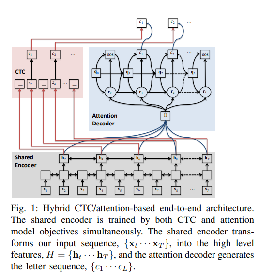

## WeNet端到端语音识别框架

田兴 2023/3/20


```text
https://github.com/wenet-e2e/wenet
```


### 介绍

wenet 是一个基于 transformer 的端到端语音识别工具包, 其模型训练的部分完全基于 PyTorch 实现. 

wenet 团队提供了完善的代码实现, 模型训练与评估流程, 因此使用者几乎只需要准备好自己的数据, 然后直接使用它们的代码就可以跑通整个演示过程. 

语音识别模型, 为了适配语言模型, 热词增强等功能, 还需要用到 C++ 库 openfst. 因此, 需要采用 C++ 布署, wenet 团队提供了模型布署的 C++ 演示, 但真正的生产布署还是需要二次开发. 如果不使用语言模型, 等功能, 就可以采用纯 python 实现, 布署相对容易很多. 

对 wenet 的学习, 主要集中在 (1) 对算法原理的学习, (2) C++布署学习, (3) 对openfst 生成的 WFST 图解码的学习. 充分的学习才能灵活地调整, 以适应不同的应用场景. 


### WeNet框架介绍


#### WeNet 模型框架




##### Hybrid CTC/Attention 架构

```text
Hybrid CTC/Attention Architecture for End-to-End SpeechRecognition
https://www.merl.com/publications/docs/TR2017-190.pdf
```


**Attention方法** 允许不连续的对齐, 比如机器翻译中, 两个序列并不是按顺序的一一对齐关系. 但是, 语音识别中的输入语音与输出文字基本是按顺序完全对齐的. 

优点: 它没有条件独立假设, 解码时不需要语言模型. 

缺点: 由于对齐关系是无序的, 这种方法容易出现 "删除" 和 "插入" 错误. 

**CTC方法** 执行强制单调对齐, 但它是条件独立假设, 即输出标签没有考虑上下文关系. 

优点: 强制单调对齐, 对输入语音和输出文字具有对齐约束. 

缺点: 条件独立, 解码时需要单独的语言模型 (数据量足够大时, 不需要). 

**Hybrid CTC/Attention方法** 将 **CTC方法** 附加到 **Attention方法** 的编码器后面, 对其施加单调对齐约束, 大大减少无序对齐问题, 弱化了 Attention方法的缺点. 

解码时, (1)采用CTC方法输出候选句子, (2)采用Attention方法, 对候选句子打分, (3)对CTC方法和Attention方法的分数加权求和, 得到最后分数. 

优点: 

(1) CTC方法的解码, 一次性输出结果, 速度快. 

(2) Attention方法重打分, 可考虑到上下文依赖关系. 


##### 多GPU分布式布署

语音识别, 语音合成的数据集都比较大, 一般都采用多GPU分布式训练. 


##### 模型量化

模型量化是一种模型压缩技术, 一般模型训练时采用 float32 类型即 4 个字节, 模型布署时采用 int8 类型即 1 个字节, 辅以缩放与偏执来逼近原始的 float32 值. 

模型量化可以降低模型占用的空间. 

```text
A Survey of Quantization Methods for Efficient Neural Network Inference
https://arxiv.org/abs/2103.13630
```


##### 基于WFST的语言模型

基于 C++ 的 openfst 库, 构建加权有限状态转换图 (**W**eighted **F**inite **S**tate **T**ransducer), 最后采用维特比算法, BeamSearch 算法解码. 

```text
参考链接: 
https://www.cnblogs.com/wcxia1985/p/16753215.html

在语音识别布署中, 语言模型部分依赖 C++ 库 openfst 实现.
https://www.openfst.org/twiki/bin/view/FST/WebHome
```


### WeNet支持的模型

WeNet实现了几种热门模型, 包括: 

**Transformer** 是 BERT 模型采用的架构. 在NLP, CV, ASR 中都有使用, 非常主流. 

```text
Attention Is All You Need
https://arxiv.org/abs/1706.03762
```


**Conformer** 是在 transformer 的基础上做了改进, 即加入 CNN 卷积模块, 用于加强对局部特征的学习. 

```text
Conformer: Convolution-augmented Transformer for Speech Recognition
https://arxiv.org/abs/2005.08100
```


**Transducer** 考虑到了输出文字的上下文依赖关系, 单调对齐关系, 兼具 CTC和 Attention 的优点. 缺点是: 训练极不稳定, 非常依赖初始化的手段, 训练流程复杂, 对数据量跟计算量的要求非常高. 

```text
Sequence Transduction with Recurrent Neural Networks
https://arxiv.org/abs/1211.3711

Transformer Transducer: A Streamable Speech Recognition Model with Transformer Encoders and RNN-T Loss
https://arxiv.org/abs/2002.02562
```


**Squeezeformer** 是对 Conformer模型的改进. 

```text
Squeezeformer: An Efficient Transformer for Automatic Speech Recognition
https://arxiv.org/abs/2206.00888
```


#### WeNet包含的优化技术

WeNet 在基架构中融合了业界几乎所有的优化方法. 包含: 


#### Mocha基于块的单调注意力对齐. 

单纯的注意力机制没有单调对齐约束 (软注意力机制). 

硬单调注意力机制是严格的单调对齐, 但语音中有些单调内部的发音和文字的顺序是颠倒的 (例如 iron 中的 r 和 o 的发音是反过来的). 

因此, 在大的范围内做单调对齐, 在小的范围内允许无序对齐是有帮助的. 

```text
Mocha: Monotonic Chunkwise Attention
https://arxiv.org/abs/1712.05382

硬单调注意力机制
Online and Linear-Time Attention by Enforcing Monotonic Alignments
https://arxiv.org/abs/1704.00784
```


#### Average Checkpoint模型平均. 

将最后几个模型做平均, 能起到集成模型的做用, 使结果更稳定, 准确. 

```text
A Comparable Study on Model Averaging, Ensembling and Reranking in NMT
http://nlpr-web.ia.ac.cn/cip/ZongPublications/2018/2018-YuchenLiu-nlpcc.pdf

https://github.com/facebookresearch/fairseq/blob/main/scripts/average_checkpoints.py

```


#### Downsampling语音降采样. 

语音信号中存在冗余, 一定的降采样不会影响识别结果, 还可以提升训练和推理速度. 

```text
Learning Adaptive Downsampling Encoding for Online End-to-End Speech Recognition
http://www.apsipa.org/proceedings/2019/pdfs/15.pdf
```


#### Relative Position Representations相对位置表示

在长语音的流式识别中, 序列特别长, 绝对位置编码不能适应. 因此提出相对位置表示. 

```text
Transformer-XL: Attentive Language Models Beyond a Fixed-Length Context
https://arxiv.org/abs/1901.02860
```


### 总结

(1) WeNet框架的模型采用 PyTorch 实现, 

是比较熟悉的方法, 主要需要学习其算法原理. 


(2) 语言模型采用 C++ 库 openfst 实现. 

* 一般的语音识别模型是比较通用的模型, 但是在特定领域, 为了提高一些句子的概率而应用语言模型. 

* 需要 C++ 服务布署. 

前期我们可以不使用这部分, 只做纯 python 的模型布署, 再逐步优化. 


(3) WeNet 框架中的实现是一种演示的代码. 各种应用的代码实现都比较简单, 对于 C++ 布署, 需要较多的重新编码. 


### 讨论


#### 已经完成了ASR的入门

目前基于 WeNet 框架的理论入门已经完成, 并且有能力实现基于纯 python 部分的模型训练, 模型布署全流程. 


#### 从开源模型来始探索

就目前 whisper 的经验. 

* 对于实际应用, 布署开源模型, 再根据实际情况做优化是比较经济的方向. 

* 对开源模型的布署, 学习, 也可以提升对该领域的熟悉程度. 


在对开源模型的探索过程中, 逐渐积累能力, 先在开源数据集上做实现. 技术能力比较成熟之后, 公司再提供数据. 


#### 需要GPU

* 对开源模型做微调, 需要算力. 
* 预研, 学习, 测试, 都需要算力. 


GPU 的使用一般是断断续续地. 

(1) 训练模型的时候. 

(2) 代码编写, 测试. 

(3) 数据清洗都需要使用. 


如果使用云服务器: 

(1) 如果自己一段时间没用, 一想到一天多少钱, 会觉得不舒服. 

(2) 每次重新买机器装环境又需要大半天的时间. 很不方便. 


语音识别, 语音合成的模型训练一般都采用多 GPU 分布式. 


目前公司已有一个 GPU. 因此, 我建议: 公司自己买 GPU. 建议数量 1, 3 或者 7 个. 


