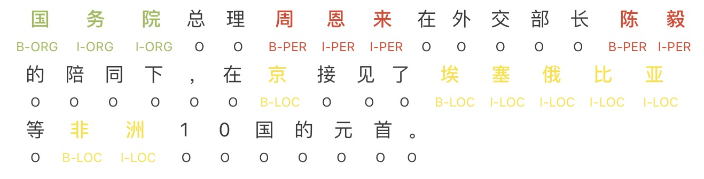
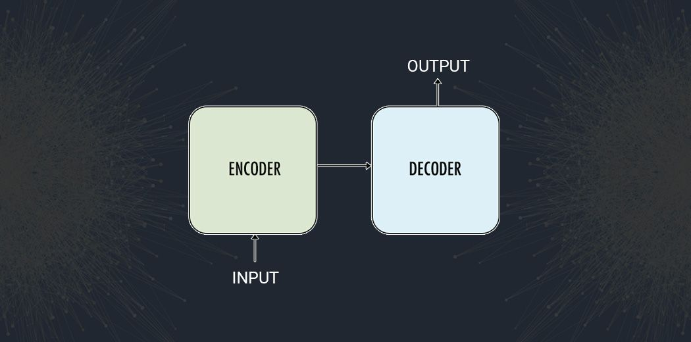
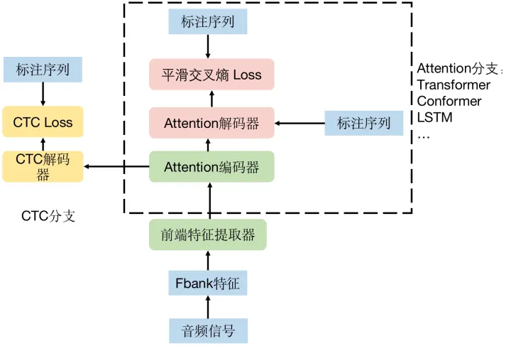
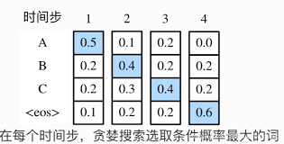

## 端到端语音识别简介

田兴: 2023/3/13


### 深度学习简单示例

对于等式: 

$$\begin{aligned} ax &= y \end{aligned}$$ 


令 $x = 1$, $y = 2$, 求参数 $a$ 的值: 

$$\begin{aligned} \text{Step1} & \text{: 随机初始化, 得到 a = 0.45: } \\ \text{Step2} & \text{: forward 前向传播, 如下: } \\ & 0.45 \times 1 = 0.45 \\ \text{Step3} & \text{: 根据 y=2, 计算误差: } \\ & \Delta{y} = 2 - 0.45 = 1.55 \\ \text{Step4} & \text{: 求导数: } \\ & \frac{\partial{y}}{\partial{a}} = x = 1 \\ \text{Step5} & \text{: 令 learning rate 学习率为 lr=0.0001, 做 backward 反向传播: } \\ & \Delta{a} = \text{lr} \times \Delta{y} \times \frac{\partial{a}}{\partial{y}} = 0.0001 \times (2 - 0.45) \times \frac{1}{1} = 0.0001 \times 1.55 = 0.000155 \\ \text{Step6} & \text{: 更新 a 的值: } \\ & a' = a + \Delta{a} = 0.45 + 0.000155 = 0.450155 \\ \text{Step7} & \text{: forward 前向传播, 如下: } \\ & 0.450155 \times 1 = 0.450155 \\ & \text{循环, 返回 Step 3... } \end{aligned}$$ 


示例: 

```python
#!/usr/bin/python3
# -*- coding: utf-8 -*-

a = 0.45
x = 1
y = 2
lr = 0.0001

while True:
    delta_y = y - a * x
    if delta_y < 0.00001:
        break
    a = a + lr * (y - a * x) * 1 / 1

print('a: {}'.format(a))

```

以上代码输出结果为: 

```text
1.9999900001717383
```


以上是深度学习的基本原理, 其中: 

1. $ax=y$ 就是模型 (模型是一个数学公式), 
2. $a$ 是模型的参数. 
3. $x$, $y$ 是数据. 
4. $\text{lr}$ 学习率, 是超参数 (需要人工预先定义的参数). 

4. 当模型训练好之后, 使用时, 执行的是 $\text{Step2}$ , 即 forward 前向推理. 其它的 $\text{Step3-6}$ 是模型的优化过程, 即反向传播. 


```text
深度学习, 
模型: 可以理解成是一个数学公式. 模型里可能包含多个部分 (模块), 如: CNN, CNN, RNN 模型结构. 
训练好的模型: 是调整过参数的模型, 能够处理特定任务. 
模型优化算法: 对参数调整的策略, 如: SGD. 

```


### 序列标注模型


序列标注模型: 




序列标注模型: 

* 对序列中的每个符号打一个标签. 
* 输入序列和输出序列的长度相等. 


### 序列到序列模型

```text
参考链接: 
https://zhuanlan.zhihu.com/p/217447336
```


序列到序列模型: 




序列到序列模型, 例如 Google Translate, 将一个序列转换为另一个序列. 

* Encoder: 编码器, 将输入序列 (INPUT) 转换为隐状态 (特征). 
* Decoder: 解码器, 根据 Encoder 编码的**隐状态特征**和**已解码出的序列**, 每次输出一个符号. **一直循环**, 直到输出的符号是结束符号, 就停止. 
* 输入序列和输出序列长度不相关. 


### 端到端语音识别简介

```text
参考链接: 
https://zhuanlan.zhihu.com/p/536647952
```


什么是端到端: 

1. 传统的语音识别一般分为**声学模型**与**语言模型**, 声学模型负责将音频序列转化为**音素序列**, 常见的音素比如汉语拼音, 英文音标等, 语言模型则负责将这些音素序列转化成**文字序列**. 声学模型和语言模型各自独立训练, 传统语音模型的劣势在于需要有**发音字典**, 需要有音素的标注. 

2. 端到端模型就是克服了这一点, 直接将音频序列转化为文字序列. 


端到端语音模型的基本结构: 




一般的端到端语音模型结构可分成三部分, **前端特征提取器**, **CTC分支** 和 **Attention分支**. 

* 前端特征提取器: 对应序列到序列模型中的 Encoder 部分, 对音频信号进行编码 (将音频转换为特征). 
* Attention分支: 对应序列到序列模型中的 Decoder 部分, 根据音频特征输出文字. 
* CTC分支: 对应序列标签模型, 根据音频特征, 对每一帧音频打标签, 即输出文字. 


CTC 和 Attention 的区别: 

| 差异点                 | CTC                | Attention           |
| ---------------------- | :----------------- | ------------------- |
| 解码输出方式           | 按帧 frame 输出    | 按 label 输出       |
| Decoder模式            | 对输入序列逐帧标注 | 自回归生成序列      |
| 解码长度               | 输入长度           | 输出到 \<eos\> 为止 |
| 输入/输出对齐顺序性    | 有约束             | 无约束              |
| 输入/输出对齐的方式    | 穷举硬对齐         | Attention软对齐     |
| 输入/输出长度关系      | 输出不大小输入     | 无约束              |
| 天然支持流式解码       | 支持               | 不支持              |
| 输出条件独立(语言模型) | 独立               | 不独立              |


语言具有上下文关联, 即句子中的每个字符之间是存在关联关系的. 而 CTC 方式不建模这种依赖关系, Attention 方式, 是自回归模型, 能够学习这种依赖关系.  因此: 

* 一般, Attention 的方式得到的结果更准确. 
* 但是由于 Attention 解码时需要循环多次, 因此速度慢. 
* 而 CTC 方式只需要最后推理一次, 速度更快. 


现在主流的模型采用 CTC/Attention 混合的方式. 

* Attention 方式, 让模型能够学习到语言的上下文依赖关系. 
* 布署时, 使用 CTC 方式, 速度更快. 


### 语言模型

CTC 方式, 为每一帧语音帧输出标签分布的概率, 下如图所示, 模型输出每一帧对应 A, B, C, \<eos\> 标签的概率. 




搜索算法, 从这个矩阵中查找概率较大的几个序列. 并给出对应分数. 

搜索算法有: 

* GreedySearch 贪婪搜索: 每一步只取概率最大的词. 
* BeamSearch 束搜索: 每一步保留 n 个概率最大的序列, 下一步时从上一次的 n 个序列扩展, 最后仍然只保留 n 个概率. 

通过 BeamSearch, 最后会得到 n 个概率较大的序列. 针对这些序列, 再结合语言模型打分, 调整分数, 最后输出分数最高的结果. 


语言模型: 用来估计句子发生的概率. 

```text
参考链接: 
https://zhuanlan.zhihu.com/p/444093557
```

$$\begin{aligned} P(y_{1}, y_{2}, \cdots, y_{n}) = P(y_{1}) \cdot P(y_{2}|y_{1}) \cdot P(y_{3}|y_{2},y_{1}) \cdots \cdots P(y_{n} | y_{1}, \cdots , y_{n-1}) = \prod_{t=1}^{n}{P(y_{t} | y_{<t})}. \end{aligned}$$ 

上式计算句子 $(y_{1}, y_{2}, \cdots, y_{n})$ 发生的概率, 先计算 $y_{1}$ 的概率, 再计算 $y_{1}$ 之后出现 $y_{2}$ 的概率. 以此类推, 最后得到该句子发生的概率. 

比如: 

* 一些生僻字出现的概率比较低. 
* 看到句子的 "一些生僻字出现的概率比较" 部分, 我们会很肯定地推断最后一个字是 "低", "小" 等等. 因此最后一个字根前面的文字是有依赖关系的. 


针对通信领域, 那么通信相关的句子出现的概率就高, 因此, 语言模型可以起到对模型结果进行微调的作用. 


```text
在语音识别布署中, 语言模型部分依赖 C++ 库 openfst 实现. 
https://www.openfst.org/twiki/bin/view/FST/WebHome
```


### 模型训练基本流程

```text
https://dev.to/mage_ai/10-steps-to-build-and-optimize-a-ml-model-4a3h
https://www.seldon.io/how-to-build-a-machine-learning-model
https://neptune.ai/blog/improving-machine-learning-deep-learning-models
```


#### 1.数据准备

1. 标注数据是否充足. 
2. 标注是否准确. 
3. 数据集与生产环境的数据是否一致. 


#### 2.模型选择

1. 选择相关领域的常规模型, 直接训练, 得到 baseline 即参考标注, 之后的优化以 baseline 为参考. 
2. 分析任务的差异性, 可能存在的优化点. 自定义模型. 


#### 3.模型训练

理想情况下, 模型的准确率应为 100%. 但实际情况下往往不能达到, 一般的原因: 

1. 模型的学习能力不够, (改用参数更多, 更大的模型). 
2. 标注数据本身不准确, (数据清洗). 


**数据清洗** 人工标注数据时, 可能出错, 数据清洗就是将这些错误的数据找出来, 重新标注. 过程: 

1. 训练模型, 准确率达到 80%. 
2. 使用模型对数据打标签. 
3. 检查模型标签与标注标签不一致的数据. 如果标注错误, 则更改. 
4. 重新训练模型. 

数据清洗的过程包含: **模型训练** (需要算力),  **检查标注** (需要人力). 


#### 4.模型优化

当数据的质量比较高之后, 根据数据特点, 做模型优化: 

1. 根据学习的目标, 选择合适的模型. 
2. 超参数优化, 即设置不同的超参数, 找到最优的超参数. 

**模型优化** 的过程需要多次训练模型 (需要算力). 


